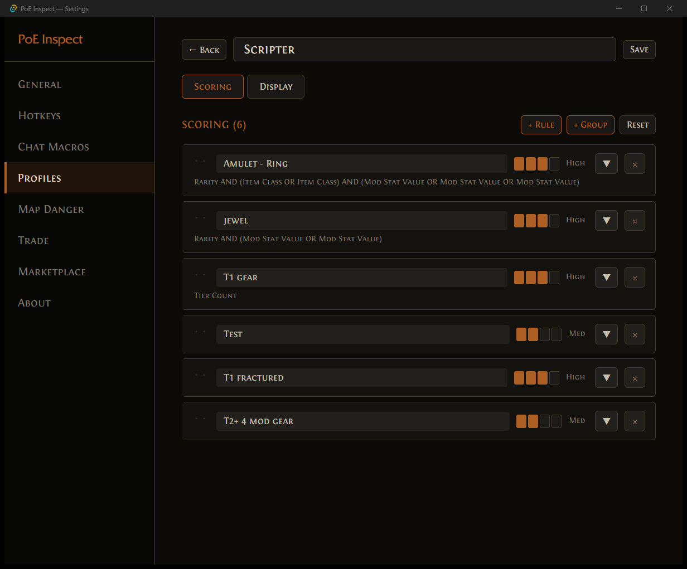
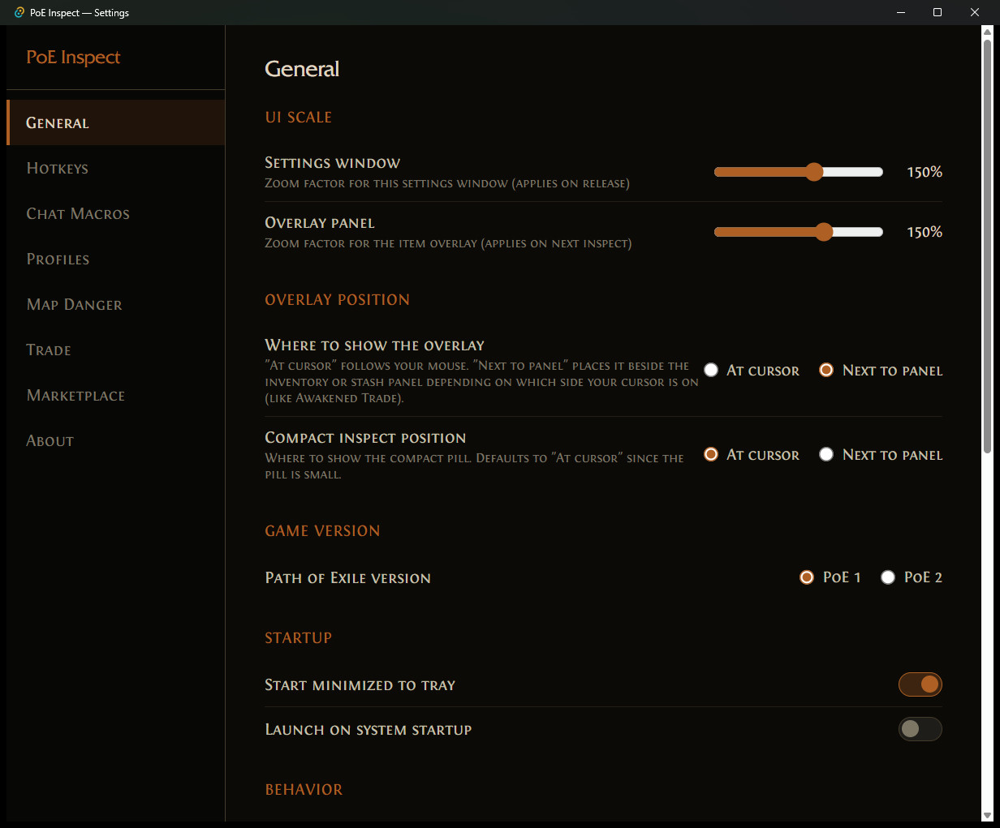
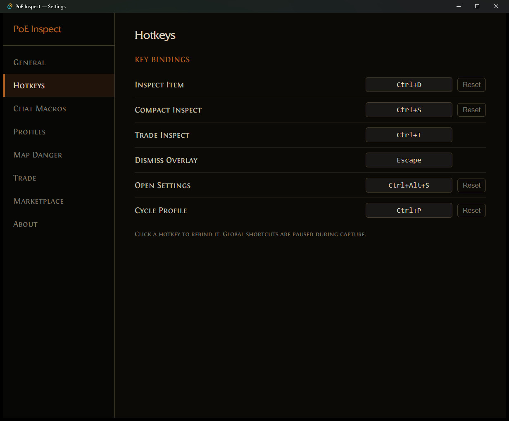
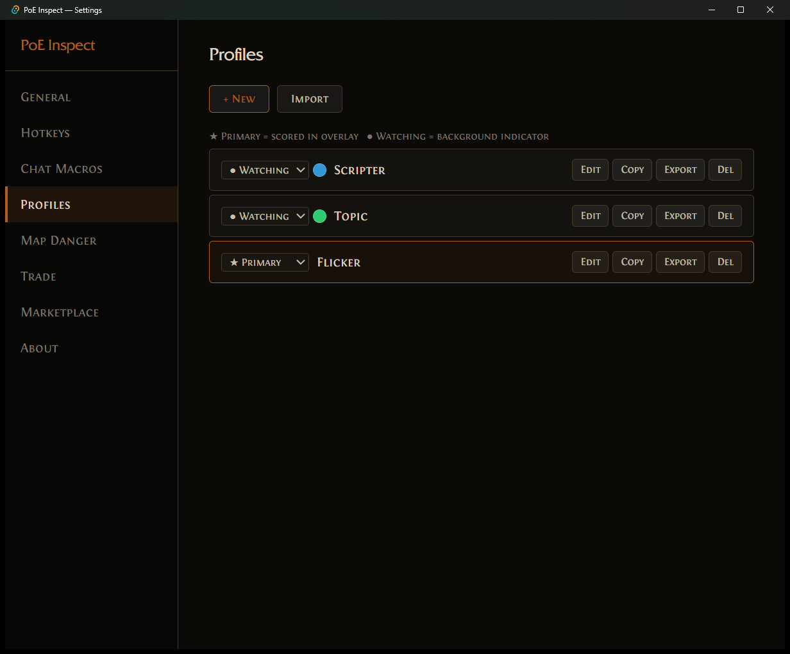
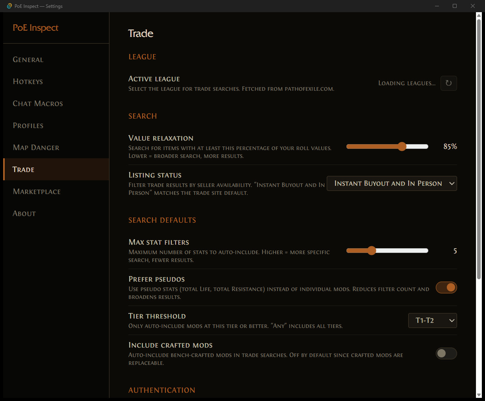

# PoE Inspect

Real-time item evaluation overlay for Path of Exile. Press a hotkey, get instant tier analysis, scoring, and trade pricing — right on top of the game.

<!-- TODO: add hero screenshot (overlay on a real item in-game) -->
<!--  -->

## Features

### Item Evaluation Overlay

Hover over any item in PoE and press **Ctrl+I**. The overlay appears near your cursor showing:

- **Mod tier colors** — each affix is colored by tier quality (T1 green through T5 red, customizable)
- **Roll quality bars** — see how close each roll is to its maximum value
- **Prefix/Suffix badges** — know at a glance which mods are prefixes vs suffixes
- **Open affix count** — see available crafting slots
- **Pseudo stats** — computed totals for resistances, life, attributes, DPS, and more

<!-- TODO: add overlay screenshot -->
<!--  -->

### Inline Trade Search

Price check items without leaving the game. The trade panel shows:

- **Price Check** — query the official trade site and see sorted price results
- **Open Trade** — jump to pathofexile.com/trade with a pre-built search
- **Edit Search** — toggle inline filter editing directly on the overlay:
  - Click mods to include/exclude them from the search
  - Adjust min/max values per stat
  - Change rarity, type scope, and item properties
  - Pseudo stats automatically map to trade API filters

<!-- TODO: add trade panel screenshot -->
<!--  -->

### Compact Inspect

Press **Ctrl+Shift+I** for a quick glance without breaking your flow. A small pill appears near your cursor showing the item name, score percentage, and map danger verdict — then auto-dismisses after 2.5 seconds.

<!-- TODO: add compact pill screenshot -->
<!--  -->

### Scoring Profiles

Create multiple evaluation profiles for different builds or playstyles:

- **Scoring rules** — weight individual stats, create compound rules (AND/OR groups)
- **Multiple profiles** — switch instantly with a hotkey or tray menu
- **Watching mode** — set secondary profiles that show colored dots on items matching their criteria
- **Import/Export** — share profiles as JSON files with friends or the community
- **Custom tier colors** — pick your own color scheme per profile



### Map Danger Assessment

Classify map mods as **Deadly**, **Warning**, or **Safe** for your build. The compact overlay shows a map verdict at a glance — red for dangerous mods, green for safe ones.

### Chat Macros

Bind custom hotkeys to in-game chat commands (e.g., `/hideout`, `/trade`). Commands are pasted and optionally sent automatically.

## Getting Started

### Installation

Download the latest release from the [Releases](https://github.com/timeloop-vault/poe-inspect/releases) page and run the installer. PoE Inspect starts minimized to the system tray.

### First Launch

1. **Right-click the tray icon** and open **Settings**
2. **General tab** — select your game version (PoE 1 or PoE 2) and adjust overlay scale if needed
3. **Trade tab** — select your league from the dropdown and optionally set your POESESSID for online-only listings
4. **Profiles tab** — the built-in Generic profile works out of the box, or create a custom profile for your build

### Basic Workflow

```
1. Play Path of Exile as usual
2. Hover over an item you want to evaluate
3. Press Ctrl+I (or your configured hotkey)
4. The overlay appears with tier analysis and scoring
5. Click "Price Check" to see trade listings
6. Press Escape or click outside to dismiss
```

**Tip:** Use **Ctrl+Shift+I** (Compact Inspect) while mapping for a quick score pill that doesn't interrupt your flow. Use **Ctrl+T** (Trade Inspect) to jump straight into trade filter editing.

## Settings

### General



- **UI Scale / Overlay Scale** — adjust the size of the settings window and overlay independently
- **Overlay Position** — "At cursor" (follows your mouse) or "Next to panel" (anchored beside PoE's inventory/stash)
- **Compact Position** — separate position setting for the compact pill
- **Game Version** — PoE 1 or PoE 2
- **Startup** — start minimized to tray, launch on system startup
- **Focus gate** — only respond to hotkeys when PoE is the active window
- **Stash scrolling** — use scroll wheel to navigate stash tabs (with configurable modifier key)
- **Display toggles** — show/hide roll bars, tier badges, prefix/suffix labels, open affix count, stat IDs

### Hotkeys



Six configurable hotkeys with conflict detection:

| Action | Default | Description |
|--------|---------|-------------|
| Inspect Item | Ctrl+I | Full overlay with evaluation |
| Compact Inspect | Ctrl+Shift+I | Quick pill near cursor |
| Trade Inspect | Ctrl+T | Overlay focused on trade filters |
| Dismiss Overlay | Escape | Close current overlay |
| Open Settings | Ctrl+Shift+S | Open settings window |
| Cycle Profile | Ctrl+Shift+P | Switch active profile |

Click any hotkey button and press your desired key combination to rebind.

### Profiles



Profiles control how items are scored. Each profile has:

- **Role** — Primary (active scorer), Watching (shows colored dot), or Off
- **Scoring rules** — start from the Generic profile or build custom rules
- **Display settings** — custom tier colors, mod highlighting, dim irrelevant mods
- **Map danger config** — per-profile mod classifications

Use **Import/Export** to share profiles as JSON files.

### Trade



- **League** — auto-populated from the GGG API, supports private leagues
- **Value Relaxation** — broaden searches by accepting lower rolls (50-100%)
- **Listing Status** — filter by seller availability
- **Search Defaults** — max stats, prefer pseudos, tier threshold, include crafted mods
- **POESESSID** — optional session cookie for "online only" results

### Map Danger

Classify map mods by danger level for your build. Search through all map mods and tag each as Deadly, Warning, or Safe. Your classifications persist per profile and drive the compact overlay verdict.

### Chat Macros

Add custom hotkeys that type chat commands for you. Set the command text and choose whether to auto-send (press Enter after pasting).

## Building from Source

### Prerequisites

- **Rust** (latest stable, edition 2024)
- **Node.js** (18+) and npm
- **cmake** — required for poe-bundle's Oodle FFI (VS Build Tools cmake on PATH for Windows)
- **A PoE installation** — needed to extract game data from the GGPK

### Build Steps

```sh
# Clone the repository
git clone https://github.com/timeloop-vault/poe-inspect.git
cd poe-inspect

# Install frontend dependencies
cd app
npm install

# Development mode with hot reload
npm run tauri dev

# Production build
npm run tauri build
```

### Project Structure

```
crates/
  poe-dat/     — Parse .dat files and stat descriptions from GGPK
  poe-data/    — Game data types, lookup tables, domain knowledge
  poe-item/    — Parse item text (Ctrl+Alt+C) into structured types
  poe-eval/    — Evaluate items against scoring profiles
  poe-trade/   — Trade API client, stats index, query builder
  poe-bundle/  — GGPK bundle extraction (Oodle FFI)
app/           — Tauri v2 desktop application
fixtures/      — Shared item text test fixtures
docs/          — Design docs and research
```

The Rust workspace compiles ~412 crates on first build. Subsequent builds are incremental.

## Roadmap

Features in development:

- **Demand Marketplace** (experimental) — share "want lists" with friends so the overlay shows when an item matches what someone is looking for
- **Crafting advisor** — probabilistic crafting strategy recommendations
- **Flask and gem support** — parser support for all remaining item types
- **PoE 2 support** — game version abstraction for PoE 2 item formats

## Platform Support

| Platform | Status |
|----------|--------|
| Windows | Fully supported |
| Linux (X11/Wayland) | Supported |
| macOS | Planned |
