# PoE Inspect

Real-time item evaluation overlay for Path of Exile. Press a hotkey, get instant tier analysis, scoring, and trade pricing — right on top of the game.

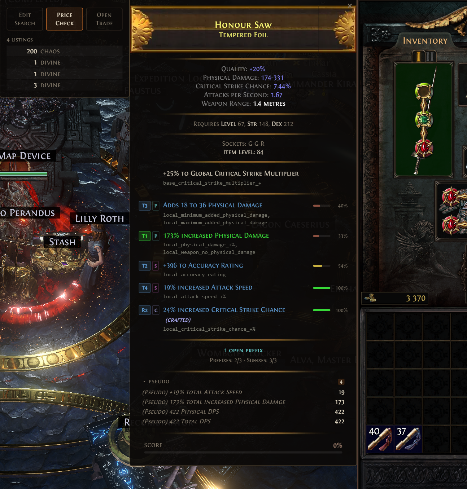

## Features

### Item Evaluation Overlay

Hover over any item in PoE and press **Ctrl+I**. The overlay replaces PoE's default tooltip with a rich evaluation panel showing tier analysis, roll quality, and scoring.

PoE's native tooltip vs PoE Inspect on the same item:

| PoE tooltip | PoE Inspect overlay |
|:-----------:|:-------------------:|
| 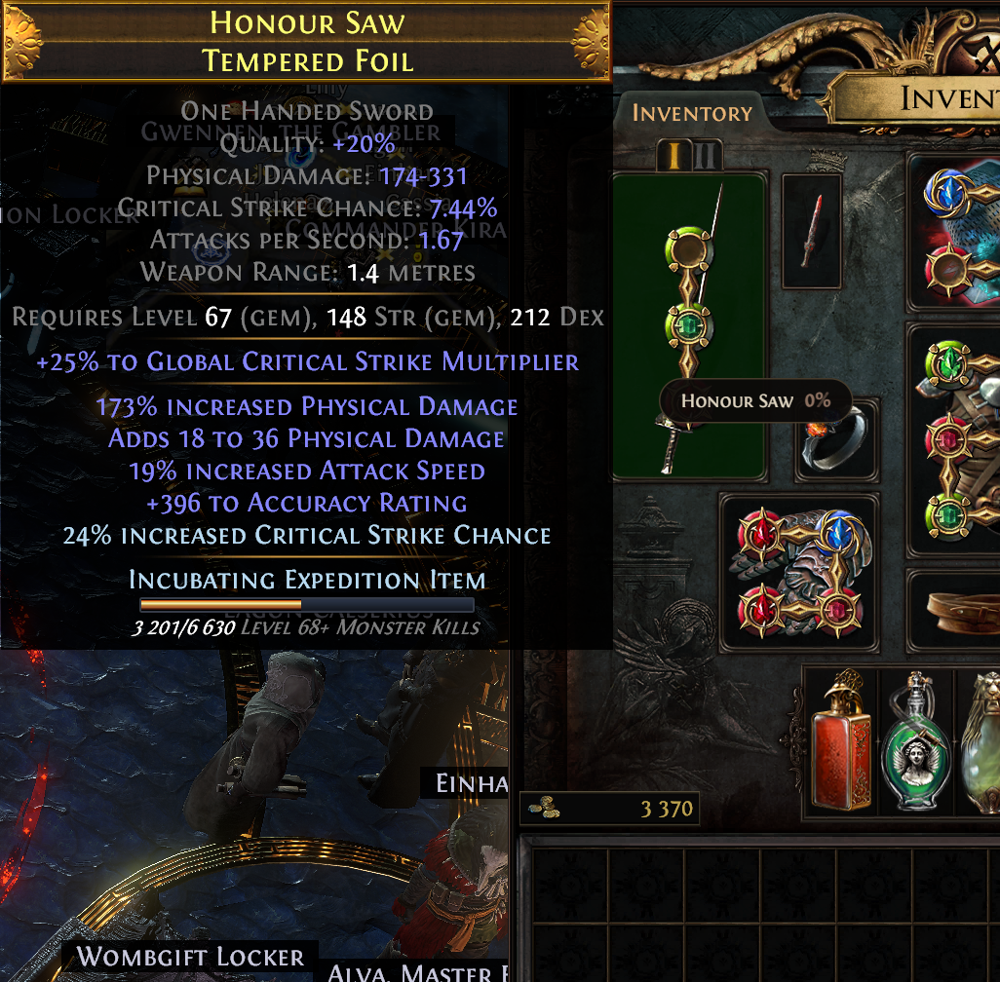 | 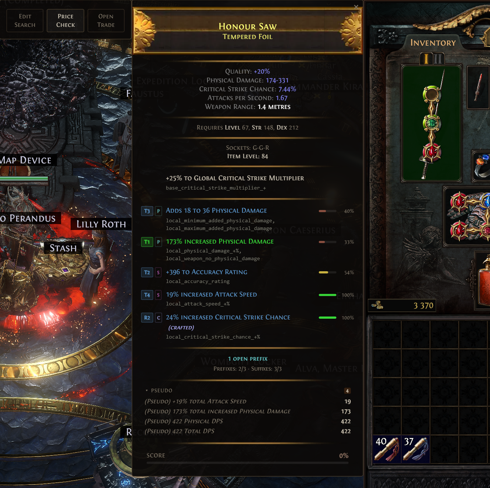 |

And for a rare staff:

| PoE tooltip | PoE Inspect overlay |
|:-----------:|:-------------------:|
| 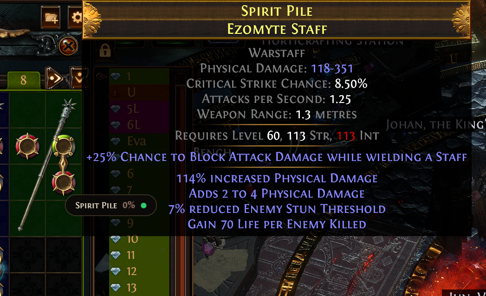 | 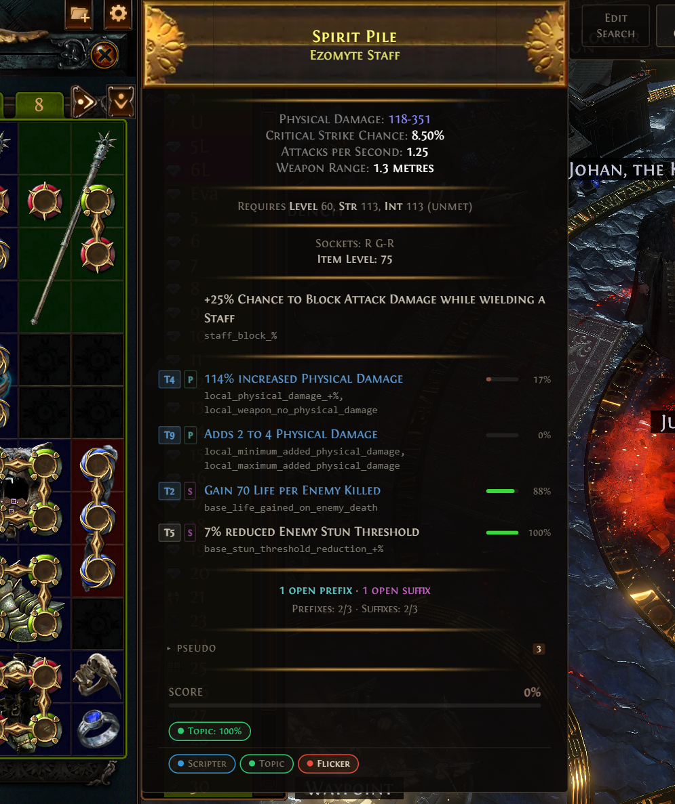 |

Every mod gets:

- **Tier badge** — T1 through T9, color-coded by quality (green = best, red = low)
- **Prefix/Suffix label** — P for prefix, S for suffix, C for crafted
- **Tier rank bar** — shows where this tier sits among all possible tiers for the mod (T1/T7 = 100%, T7/T7 = 0%). Hover to see the roll quality within the tier.
- **Stat IDs** — optional display of internal stat identifiers (power user toggle)
- **Open affix count** — see available crafting slots at a glance
- **Pseudo stats** — computed totals for resistances, life, attributes, DPS, and more

| Tier rank bars | Roll quality on hover |
|:--------------:|:---------------------:|
| 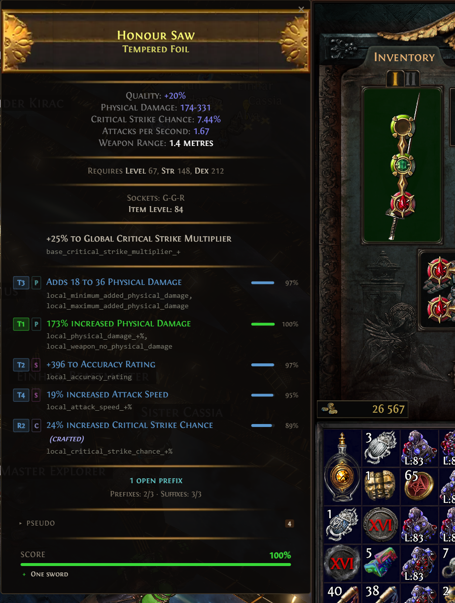 | 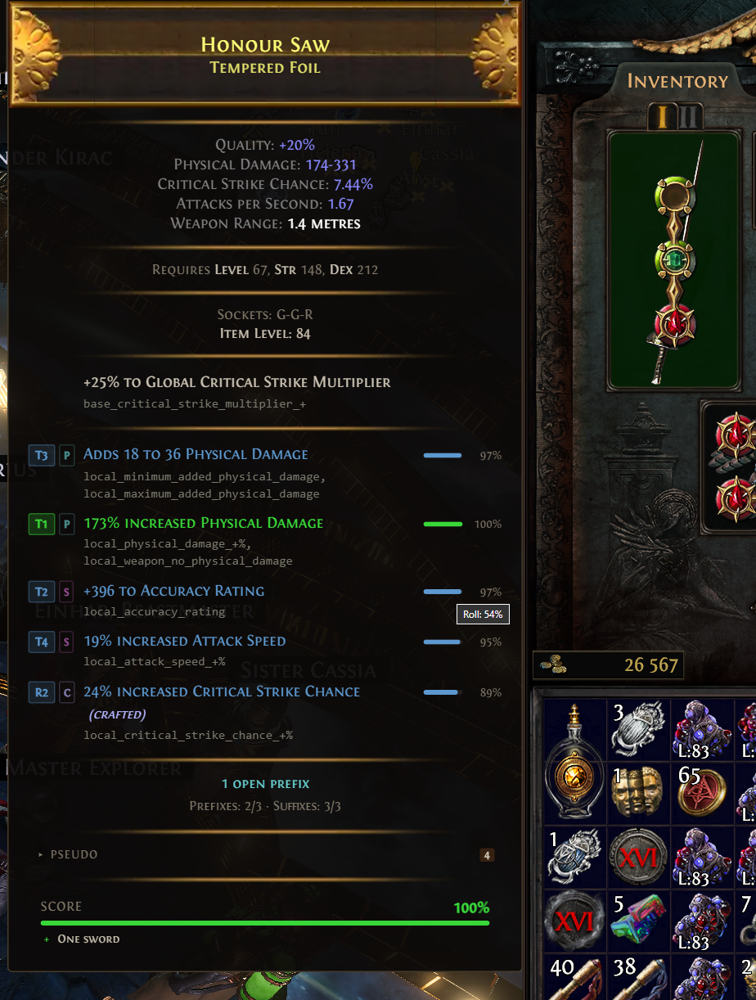 |

### Inline Trade Search

Price check items without leaving the game. Click **Price Check** to query the official trade site and see sorted price results. Click **Open Trade** to jump to pathofexile.com/trade with a pre-built search.


Click **Edit Search** to toggle inline filter editing directly on the overlay — toggle mods on/off, adjust min/max values, change rarity and type scope, configure socket filters:

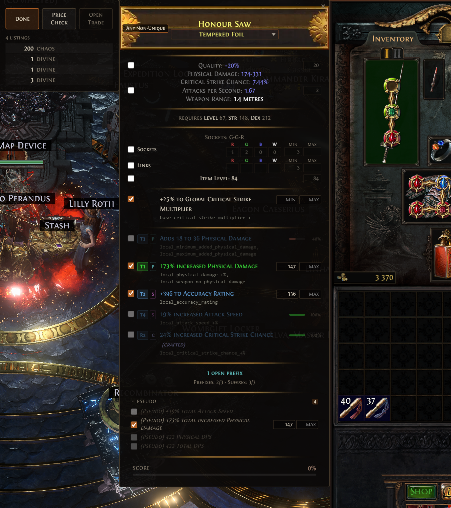

### Scoring Profiles

Create multiple evaluation profiles for different builds or playstyles. Each profile scores items independently — switch the active profile with a hotkey and the overlay updates instantly.

**Default profile (0% — item doesn't match):**


**Switch to a matching profile (100% — exactly what you need):**

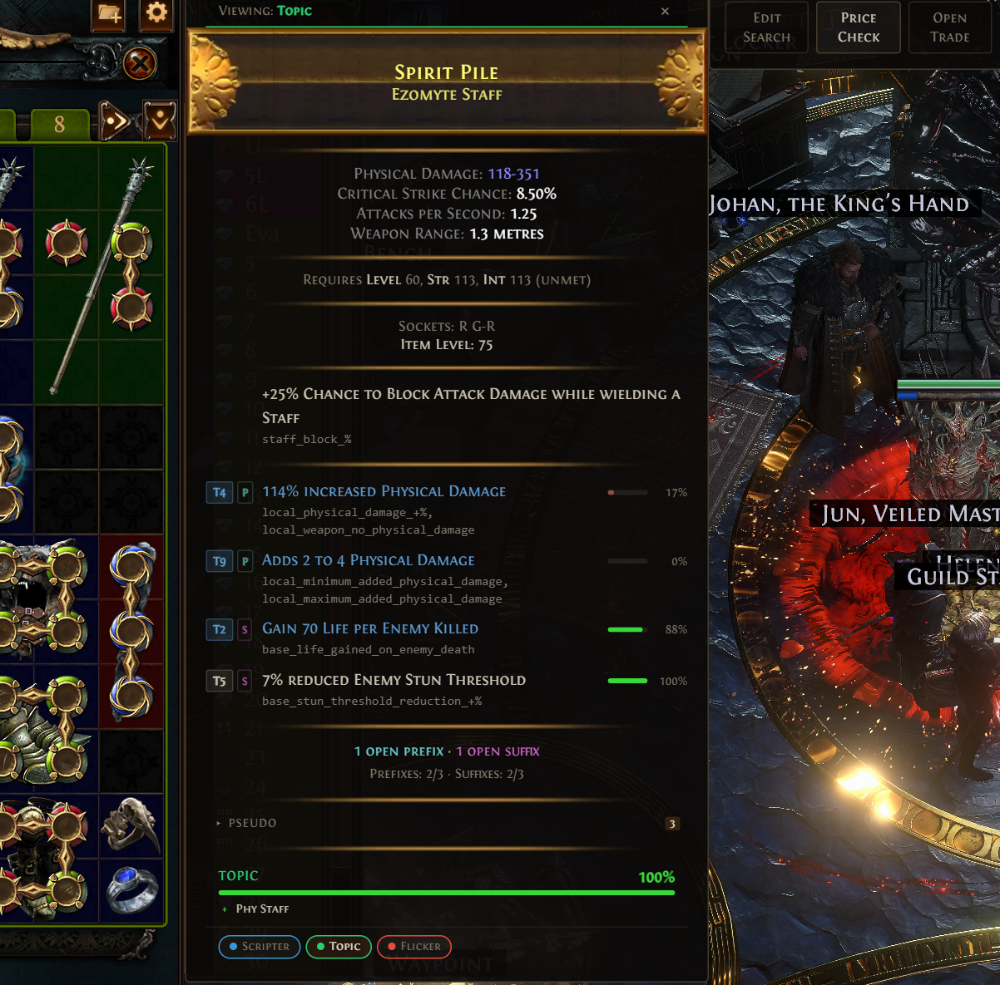

Profiles support:

- **Compound scoring rules** — weight individual stats, create AND/OR groups with type and class filters
- **Watching mode** — secondary profiles show colored dots on items matching their criteria (see the Scripter/Topic/Flicker badges at the bottom)
- **Import/Export** — share profiles as JSON files with friends or the community
- **Custom tier colors** — pick your own color scheme per profile

### Compact Inspect

Press **Ctrl+Shift+I** for a quick glance without breaking your flow. A small pill appears near your cursor showing the item name, score percentage, and map danger verdict — then auto-dismisses after 2.5 seconds. No need to open the full overlay:

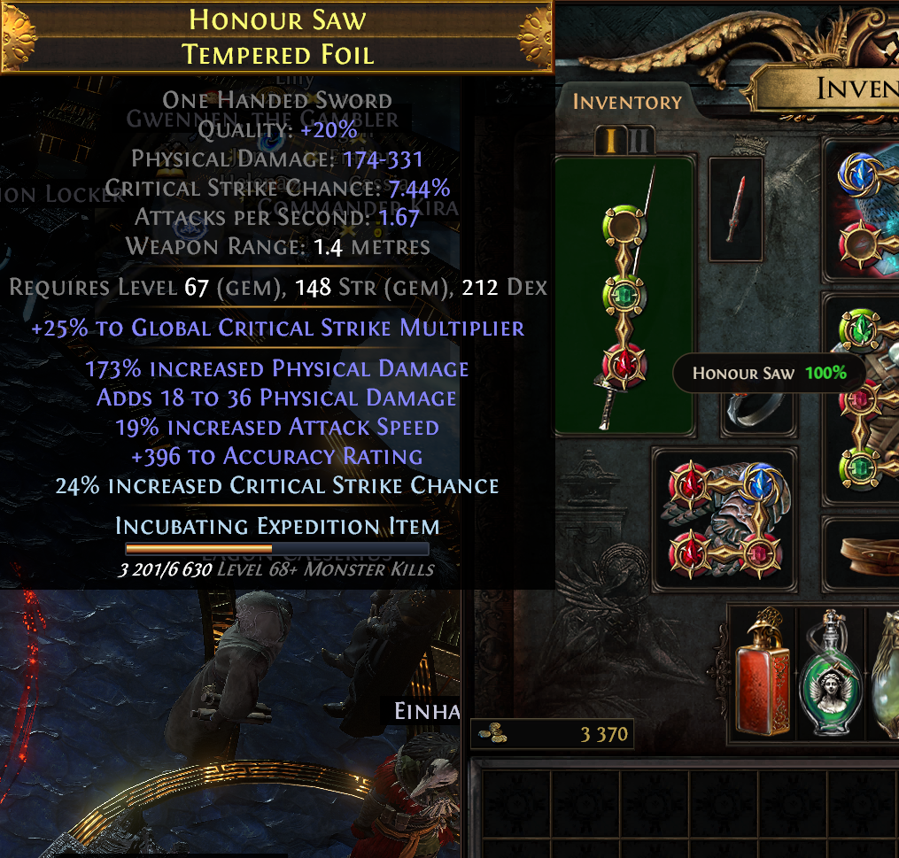

### Map Danger Assessment

Classify map mods as **Deadly**, **Warning**, or **Safe** for your build. The overlay shows a map verdict at a glance — dangerous mods are highlighted and the overall danger level is displayed prominently.

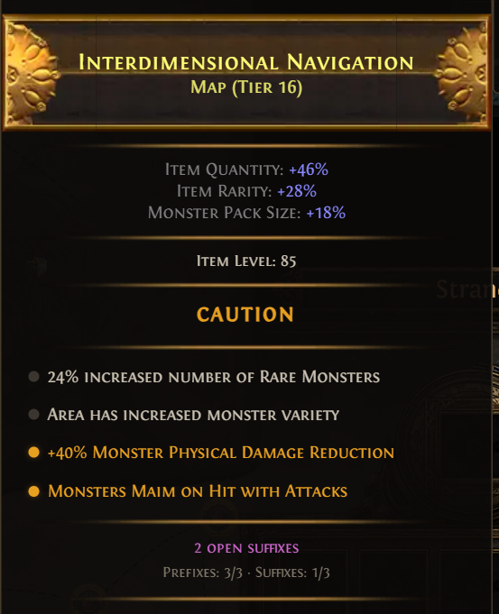

### Chat Macros

Bind custom hotkeys to in-game chat commands (e.g., `/hideout`, `/trade`). Commands are pasted and optionally sent automatically.

## Getting Started

### Installation

Download the latest release from the [Releases](https://github.com/timeloop-vault/poe-inspect/releases) page and run the installer. PoE Inspect starts minimized to the system tray.

### First Launch

1. **Right-click the tray icon** and open **Settings**
2. **General tab** — select your game version (PoE 1 or PoE 2) and adjust overlay scale if needed
3. **Trade tab** — select your league from the dropdown and optionally set your POESESSID for online-only listings
4. **Profiles tab** — the built-in Generic profile works out of the box, or create a custom profile for your build

### Basic Workflow

```
1. Play Path of Exile as usual
2. Hover over an item you want to evaluate
3. Press Ctrl+I (or your configured hotkey)
4. The overlay appears with tier analysis and scoring
5. Click "Price Check" to see trade listings
6. Press Escape or click outside to dismiss
```

**Tip:** Use **Ctrl+Shift+I** (Compact Inspect) while mapping for a quick score pill that doesn't interrupt your flow. Use **Ctrl+T** (Trade Inspect) to jump straight into trade filter editing.

## Settings

### General

Configure overlay appearance, game version, startup behavior, and display toggles.

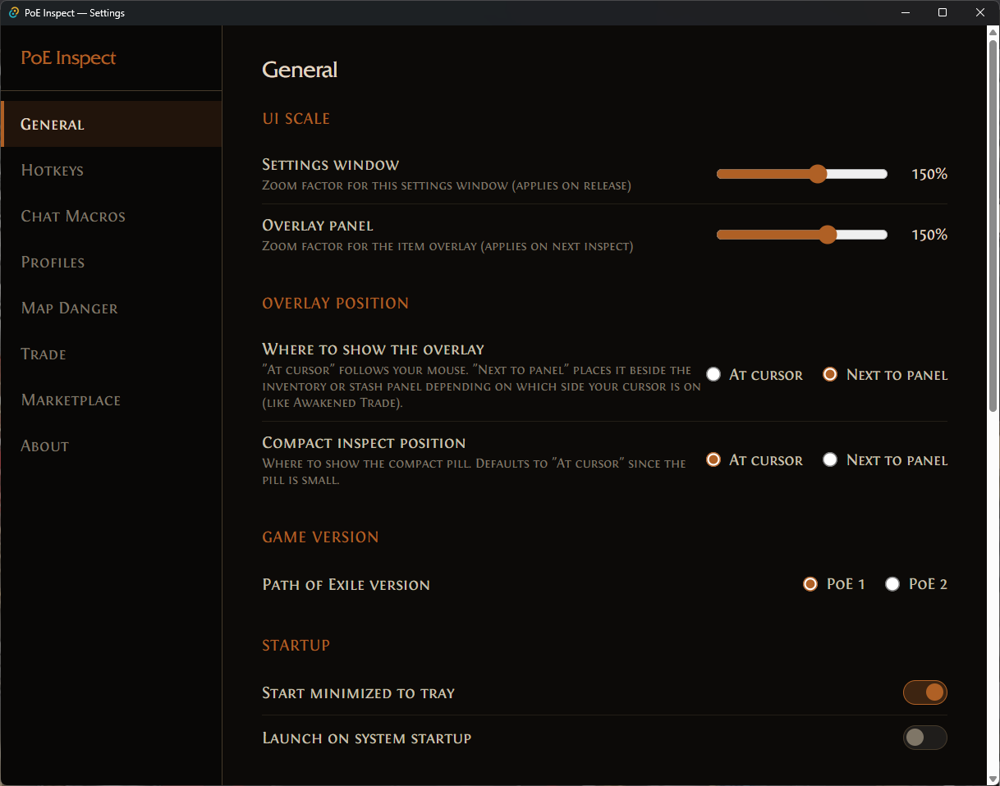

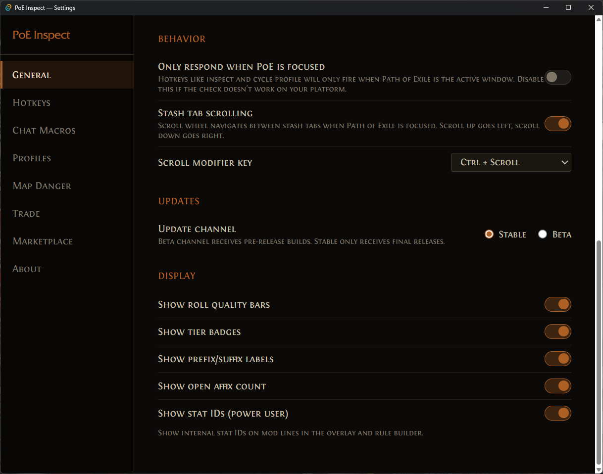

- **UI Scale / Overlay Scale** — adjust the size of the settings window and overlay independently
- **Overlay Position** — "At cursor" (follows your mouse) or "Next to panel" (anchored beside PoE's inventory/stash)
- **Compact Position** — separate position setting for the compact pill
- **Game Version** — PoE 1 or PoE 2
- **Startup** — start minimized to tray, launch on system startup
- **Focus gate** — only respond to hotkeys when PoE is the active window
- **Stash scrolling** — use scroll wheel to navigate stash tabs (with configurable modifier key)
- **Update channel** — Stable or Beta
- **Display toggles** — show/hide tier rank bars, tier badges, prefix/suffix labels, open affix count, stat IDs

### Hotkeys

Six configurable hotkeys with conflict detection:

| Action          | Default      | Description                      |
| --------------- | ------------ | -------------------------------- |
| Inspect Item    | Ctrl+I       | Full overlay with evaluation     |
| Compact Inspect | Ctrl+Shift+I | Quick pill near cursor           |
| Trade Inspect   | Ctrl+T       | Overlay focused on trade filters |
| Dismiss Overlay | Escape       | Close current overlay            |
| Open Settings   | Ctrl+Alt+S   | Open settings window             |
| Cycle Profile   | Ctrl+P       | Switch active profile            |

Click any hotkey button and press your desired key combination to rebind.

### Profiles

Profiles control how items are scored. Build custom scoring rules with compound logic, type filters, and stat weights.

**Scoring tab** — define rules with AND/OR groups, item class filters, and stat thresholds:

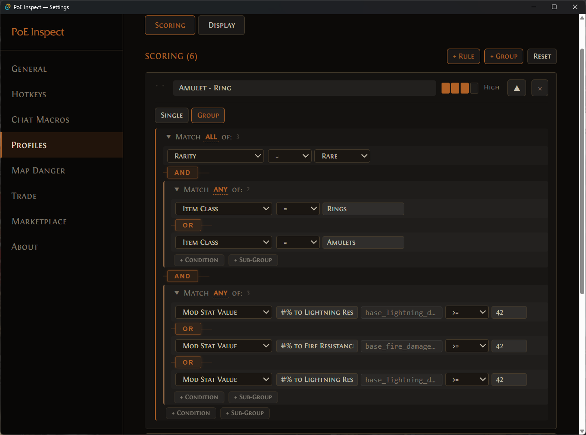

A more advanced profile with DPS-focused rules:

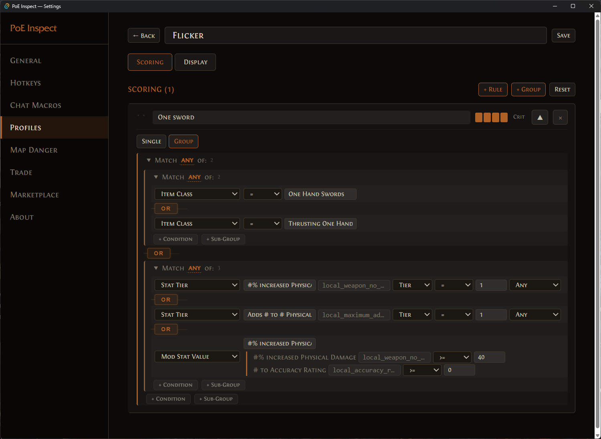

**Display tab** — customize tier colors and mod highlighting per profile:

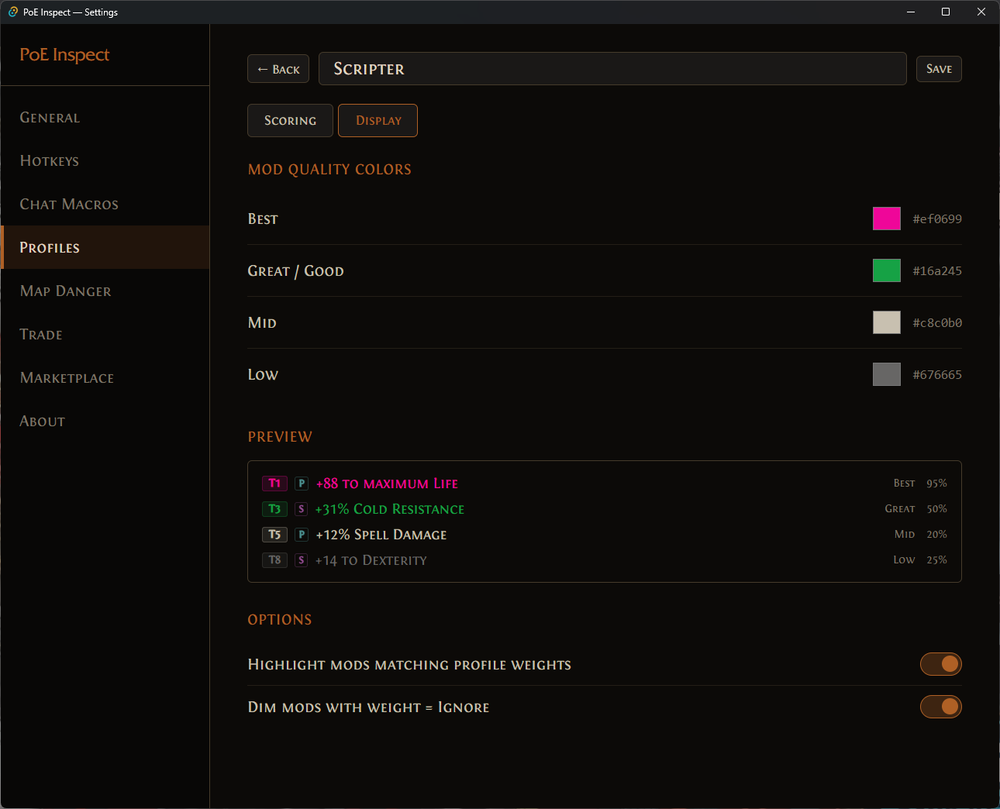

Each profile has:

- **Role** — Primary (active scorer), Watching (shows colored dot), or Off
- **Scoring rules** — start from the Generic profile or build custom rules
- **Display settings** — custom tier colors, mod highlighting, dim irrelevant mods
- **Map danger config** — per-profile mod classifications

Use **Import/Export** to share profiles as JSON files.

### Trade

Configure league, search defaults, and authentication for trade queries.

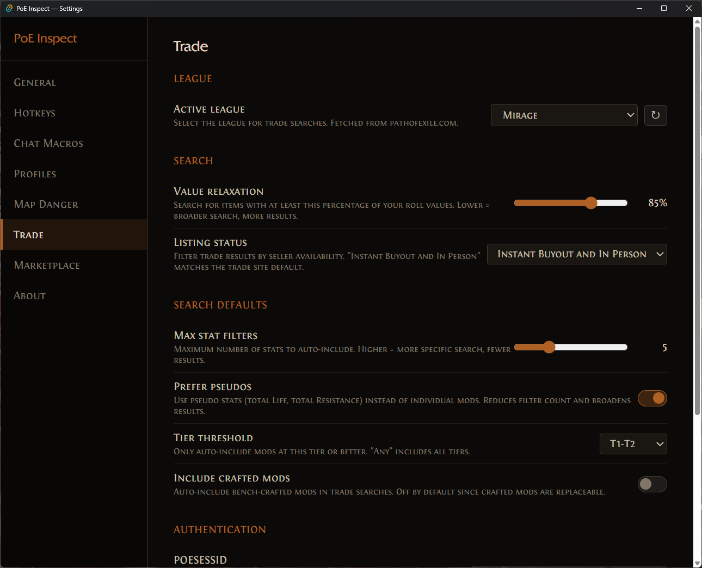

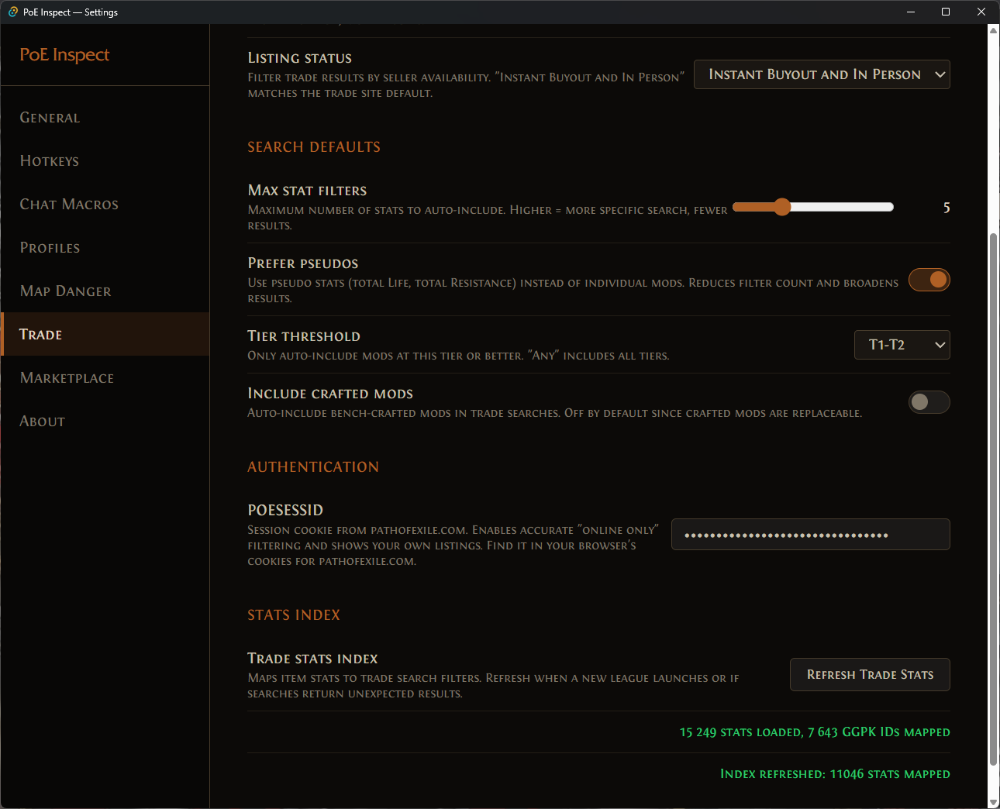

- **League** — auto-populated from the GGG API, supports private leagues
- **Value Relaxation** — broaden searches by accepting lower rolls (50-100%)
- **Listing Status** — filter by seller availability
- **Search Defaults** — max stats, prefer pseudos, tier threshold, include crafted mods
- **POESESSID** — optional session cookie for "online only" results
- **Stats Index** — refresh trade stat mappings from the official API

### Map Danger

Classify map mods by danger level for your build. Each profile has its own independent danger classifications.

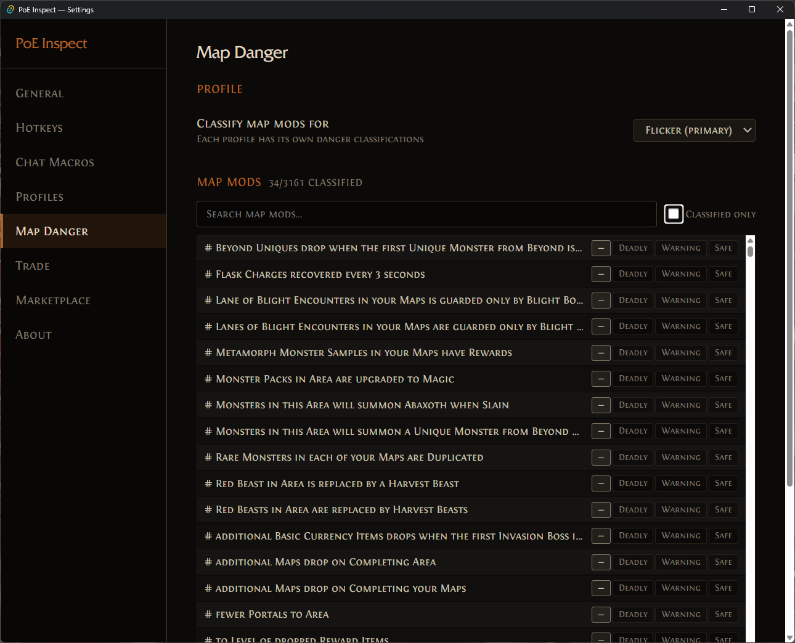

Use the "Classified only" filter to review your configured mods:

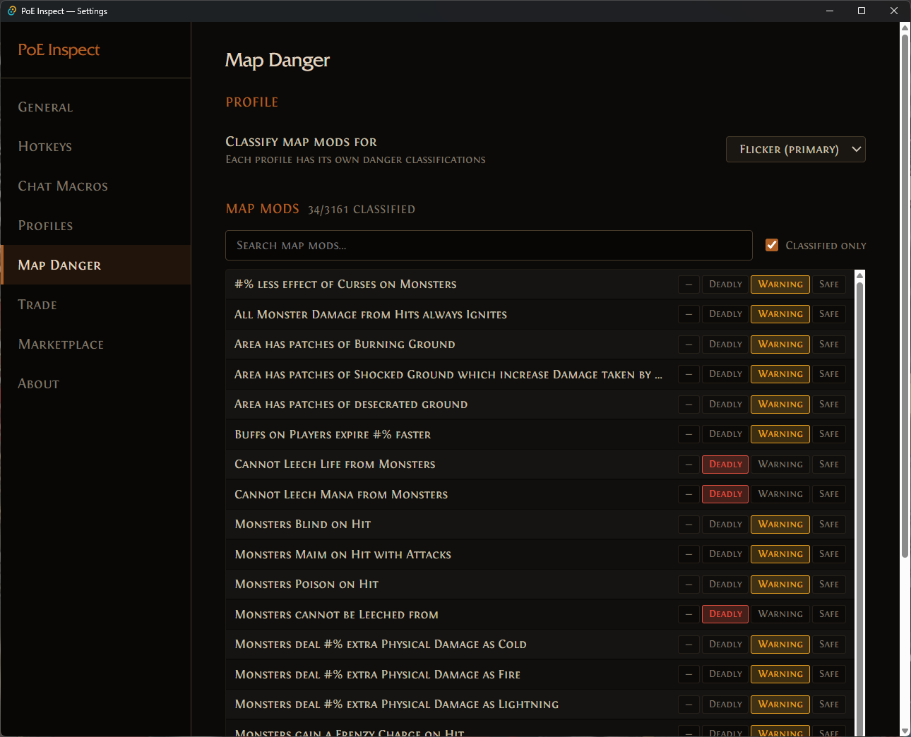

### About

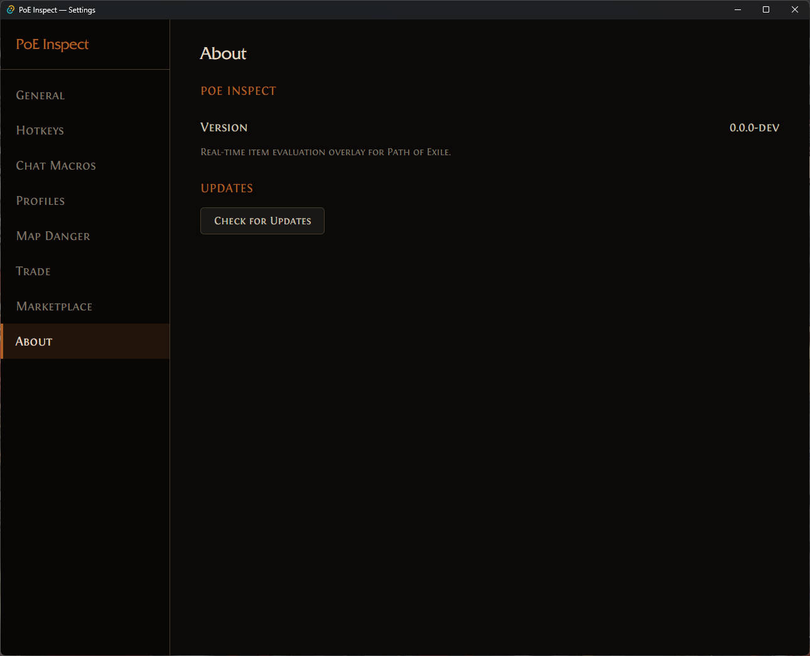

Check for updates and see the current app version. Supports automatic download and install.

## Building from Source

### Prerequisites

- **Rust** (latest stable, edition 2024)
- **Node.js** (18+) and npm
- **cmake** — required for poe-bundle's Oodle FFI (VS Build Tools cmake on PATH for Windows)
- **A PoE installation** — needed to extract game data from the GGPK

### Build Steps

```sh
# Clone the repository
git clone https://github.com/timeloop-vault/poe-inspect.git
cd poe-inspect

# Install frontend dependencies
cd app
npm install

# Development mode with hot reload
npm run tauri dev

# Production build
npm run tauri build
```

### Project Structure

```
crates/
  poe-dat/     — Parse .dat files and stat descriptions from GGPK
  poe-data/    — Game data types, lookup tables, domain knowledge
  poe-item/    — Parse item text (Ctrl+Alt+C) into structured types
  poe-eval/    — Evaluate items against scoring profiles
  poe-trade/   — Trade API client, stats index, query builder
  poe-bundle/  — GGPK bundle extraction (Oodle FFI)
app/           — Tauri v2 desktop application
fixtures/      — Shared item text test fixtures
docs/          — Design docs and research
```

The Rust workspace compiles ~412 crates on first build. Subsequent builds are incremental.

## Roadmap

Features in development:

- **Demand Marketplace** (experimental) — share "want lists" with friends so the overlay shows when an item matches what someone is looking for
- **Crafting advisor** — probabilistic crafting strategy recommendations
- **Flask and gem support** — parser support for all remaining item types
- **PoE 2 support** — game version abstraction for PoE 2 item formats

## Platform Support

| Platform            | Status          |
| ------------------- | --------------- |
| Windows             | Fully supported |
| Linux (X11/Wayland) | Supported       |
| macOS               | Planned         |
